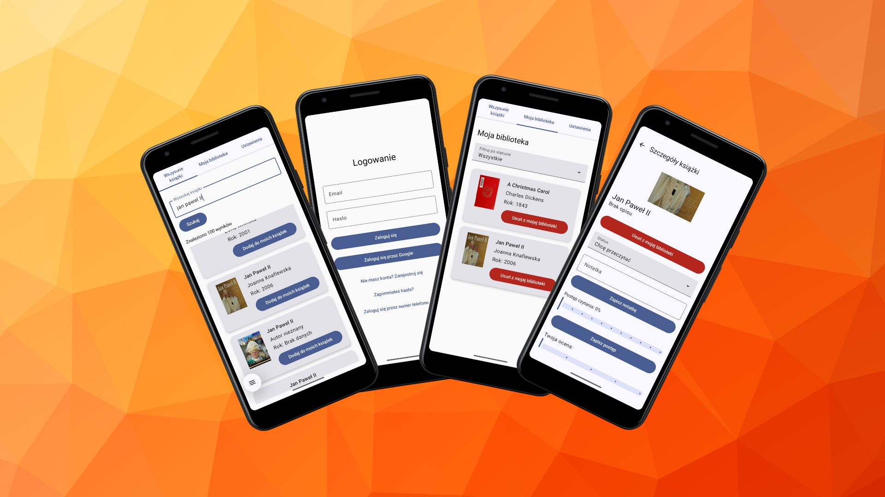

<!-- back to top -->
<a name="readme-top"></a>

[](/README-overview.md)

<!-- PROJECT LOGO -->
<br />
<div align="center">
  <a href="https://github.com/PrzemekTypa/BookTracker-mobile">
    
  </a>

<h3 align="center">BookTracker</h3>

  <p align="center">
    BookTracker-mobile is a Kotlin Android app that allows users to catalog books, rate them, and track their reading progress.
    <br />
    <br />
  </p>
</div>




## Features

- The user can add books to their collection.
- The user can edit the details of books in their collection
- The user can rate books and add reviews.
- The user can view a list of books they want to read, are reading, or have already read.
- The user can track their reading progress.
- The user can add books to their "want to read" list.
- The user can create an account / log in / log out.
- The user can log in through google.
- The user can log in through phone number.
- The user can reset their password.
- The user can track offline reading progress.
- The application supports languages: Polish, English(soon).

## Technology Stack

- Kotlin
- Jetpack Compose
- MVVM architecture
- Hilt (Dependency Injection)
- Retrofit (network)
- StateFlow / ViewModel
- Navigation Compose
- Coil (image loading)

## Project Structure
```
com.example.booktrackermobile/
│
├── model/          # Modele danych (np. Book, User) – klasy reprezentujące strukturę danych
│
├── navigation/     # Nawigacja w aplikacji – definicje tras, NavGraph, kontrola przepływu ekranów
│
├── network/        # Warstwa sieciowa – API, Retrofit, zapytania HTTP
│
├── repository/     # Repozytoria – logika dostępu do danych z różnych źródeł (API, lokalne DB)
│
├── screens/        # Ekrany UI – pliki z interfejsem użytkownika (Compose), poszczególne widoki
│
├── storage/        # Lokalna pamięć – obsługa bazy danych (np. Room), SharedPreferences itp.
│
├── ui.theme/       # Motywy – kolory, typografia, style Compose
│
├── viewmodel/      # ViewModel – logika biznesowa i stan dla ekranów, zgodnie z architekturą MVVM
│
└── MainActivity    # Główna aktywność aplikacji – punkt startowy aplikacji (Compose setup)

```


## Running the Project Locally

1. Clone the repository:
```
    git clone https://github.com/yourusername/BookTracker-mobile.git
```
2. Open the project in Android Studio.

3. Requirements:

   - Android SDK 33+
   - Kotlin 1.9+
   - Gradle 8+

4. Run the project on an emulator or connected device.

5. Dependencies:

   - Android Studio should automatically resolve all Gradle dependencies.

   - If prompted, sync Gradle and install missing SDKs.

## Remote APK Installation

If you want to install the app directly on a physical device without using Android Studio:

1. Locate the release APK:
```
Path: BookTracker-mobile/app/release/app-release.apk
```
2. Transfer the APK to your Android device:

    - You can use a USB cable, Bluetooth, Google Drive, or any file-sharing method.

    - Enable "Install from unknown sources":

3. On your Android device, go to:

```
Settings > Security > Install unknown apps
```
Allow installation from the file manager or source you'll use to open the APK.

4. Install the APK:

    - Open the file manager on your device.

    - Locate app-release.apk and tap it to begin installation.

    - Follow the prompts to complete installation.

    - Launch the app from your home screen or app drawer after installation completes.


[↑ Back to top](#readme-top)


